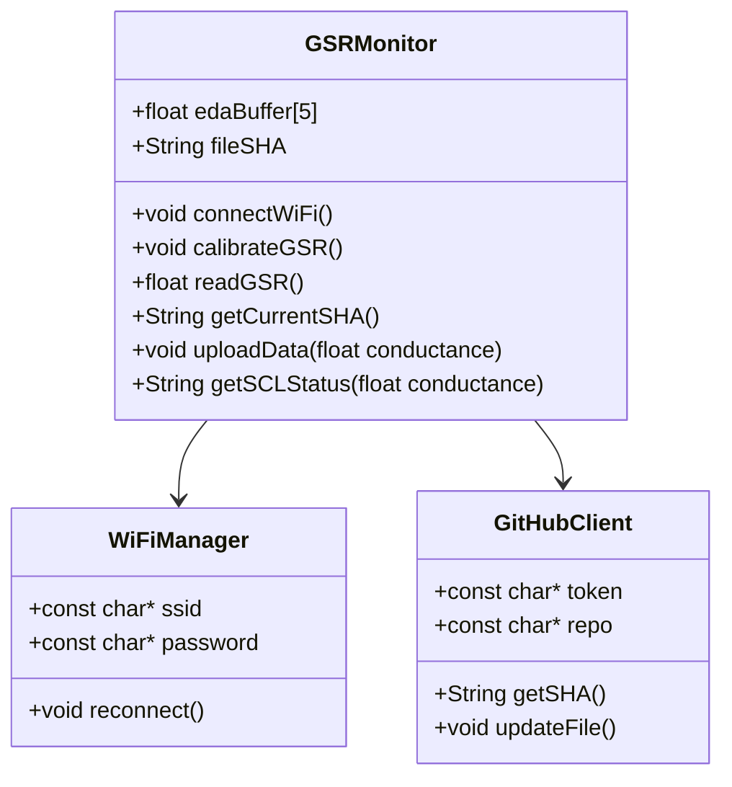
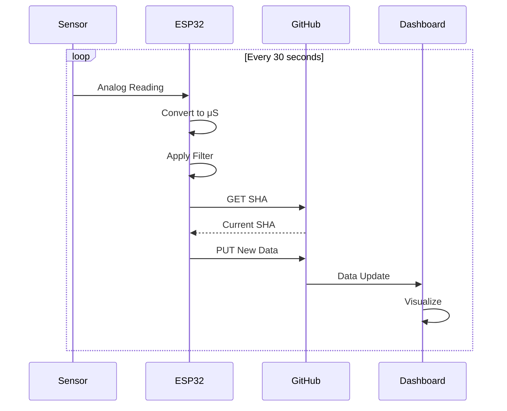
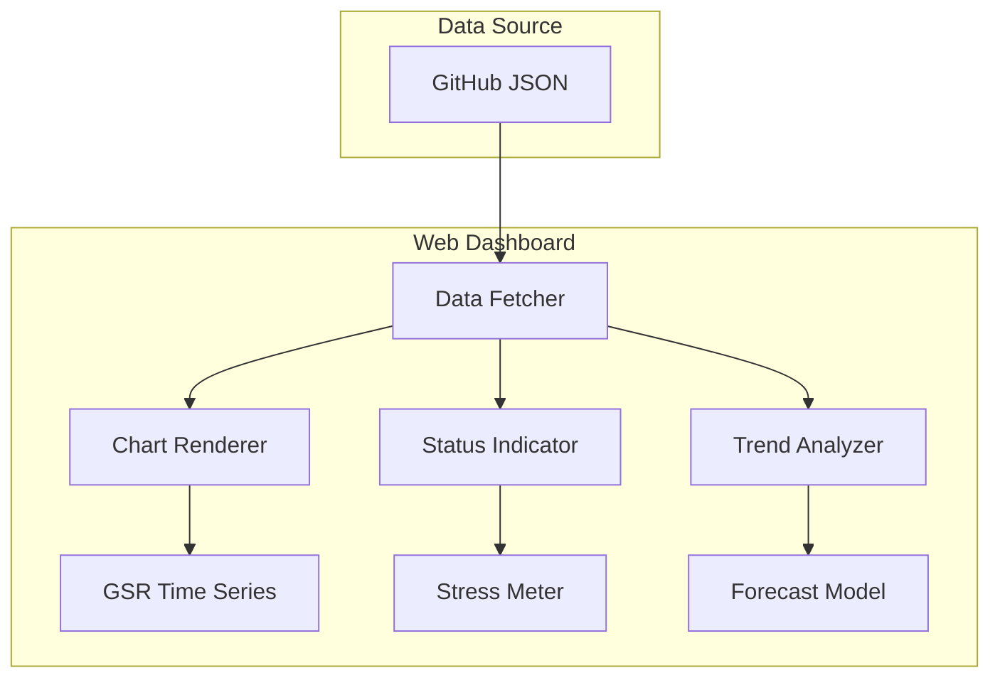
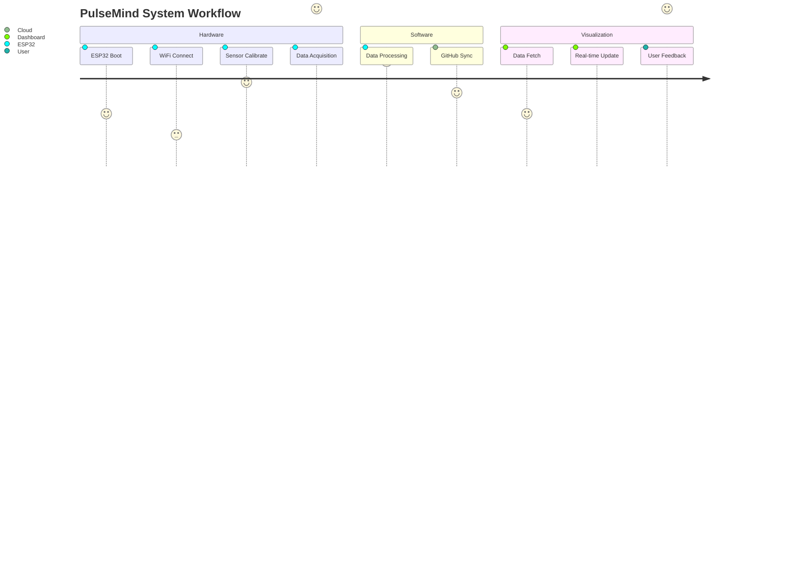
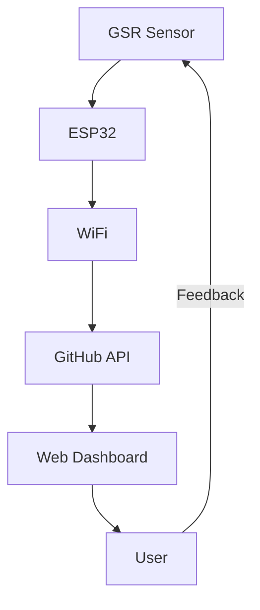
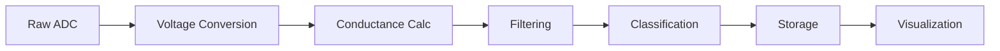

# PulseMind: GSR Monitoring System Documentation

## Table of Contents
1. [System Overview](#system-overview)
2. [Scientific Background](#scientific-background)
3. [Hardware Implementation](#hardware-implementation)
4. [Software Architecture](#software-architecture)
5. [Data Processing](#data-processing)
6. [Visualization System](#visualization-system)
7. [System Flow](#system-flow)
8. [Mathematical Formulations](#mathematical-formulations)
9. [Mermaid Diagrams](#mermaid-diagrams)
10. [References](#references)

## System Overview

PulseMind is an integrated Galvanic Skin Response (GSR) monitoring system that combines:
- ESP32-based hardware sensor
- GitHub-based data storage
- Web-based visualization dashboard

The system measures electrodermal activity (EDA) as an indicator of sympathetic nervous system arousal, which correlates with psychological stress levels.

## Scientific Background

### Electrodermal Activity Fundamentals
GSR measures changes in skin conductance (SC) with two components:
1. **Skin Conductance Level (SCL)**: Tonic baseline level (0.05-20 μS)
2. **Skin Conductance Response (SCR)**: Phasic responses to stimuli (>0.05 μS)

Key physiological relationships:
- Sweat gland activity ∝ Skin conductance
- Sympathetic arousal ∝ Sweat production
- Stress level ∝ SCL magnitude

Based on Boucsein (2012) and Dawson et al. (2011), we classify stress levels:

| Conductance (μS) | Stress Level    | Physiological State          |
|------------------|-----------------|------------------------------|
| <2.0            | Relaxed         | Parasympathetic dominance    |
| 2.0-5.0         | Normal          | Balanced autonomic tone      |
| 5.0-10.0        | Stressed        | Moderate sympathetic arousal |
| >10.0           | High Stress     | Strong sympathetic activation|

## Hardware Implementation

### Circuit Design


Key parameters:
- Electrode voltage: 3.3V DC
- Series resistance: 1MΩ
- ADC resolution: 12-bit (0-4095)
- Sampling rate: 10Hz (100ms interval)

### Signal Processing Chain
1. Raw ADC reading (0-4095)
2. Voltage conversion: 
   ```
   V = (ADC × 3.3) / 4095
   ```
3. Conductance calculation:
   ```
   G = (V / R) × 10^6 [μS]
   ```
   Where R = 1MΩ (constant)

4. Moving average filter (window size=5):
   ```
   G_filtered = Σ(G_i...G_i+4) / 5
   ```

## Software Architecture

### Arduino Code Structure


Key components:
1. **WiFi Connectivity**: Manages network connection with automatic reconnection
2. **GSR Sensor**: Handles calibration and data acquisition
3. **GitHub API Client**: Manages data storage in repository

### Data Flow


## Data Processing

### Calibration Protocol
1. 30-second baseline measurement (300 samples)
2. Calculate mean baseline conductance:
   ```
   G_baseline = (Σ(V_i)/n) × (10^6/R)
   ```
3. Adaptive thresholds:
   ```
   G_relaxed = 0.5 × G_baseline
   G_stressed = 2.5 × G_baseline
   ```

### Noise Reduction Techniques
1. Moving average filter:
   ```python
   window = [G1, G2, G3, G4, G5]
   G_filtered = sum(window) / len(window)
   ```
2. Outlier rejection (3σ principle):
   ```
   if |G_i - μ| > 3σ:
       discard sample
   ```

## Visualization System

### Dashboard Architecture


Key components:
1. Real-time GSR chart (Chart.js)
2. Stress level classification
3. Historical trend analysis
4. Predictive forecasting

### Stress Level Calculation
```
stress_level = 
  if G < 2.0: (G/2.0)×25
  elif G < 5.0: 25 + ((G-2.0)/3.0)×25
  elif G < 10.0: 50 + ((G-5.0)/5.0)×25
  else: 75 + ((G-10.0)/10.0)×25
```

## System Flow

### Complete System Workflow


## Mathematical Formulations

### Key Equations

1. **Conductance Conversion**:
   ```
   G(t) = (V(t) × 10^6) / R
   ```
   Where:
   - V(t) = Measured voltage at time t
   - R = Fixed 1MΩ resistance

2. **Moving Average**:
   ```
   Ḡ(t) = 1/N Σ G(t-i) for i=0 to N-1
   ```
   (N=5 in implementation)

3. **Stress Score**:
   ```
   S(t) = 100 × (G(t) - G_min)/(G_max - G_min)
   ```
   Where:
   - G_min = 1.0 μS
   - G_max = 20.0 μS

4. **Recovery Rate**:
   ```
   R = (T_recovery / T_total) × 100%
   ```
   Where:
   - T_recovery = Time spent below baseline
   - T_total = Total observation time

## Mermaid Diagrams

### System Architecture


### Data Processing Pipeline


## References

1. Boucsein, W. (2012). Electrodermal Activity. Springer Science.
2. Dawson, M. E., et al. (2011). The electrodermal system. Handbook of Psychophysiology.
3. Lykken, D. T., & Venables, P. H. (1971). Direct measurement of skin conductance. Psychophysiology.

This documentation provides a comprehensive technical overview of the PulseMind system, from physiological principles to implementation details. The system demonstrates how physiological signals can be captured, processed, and visualized to provide meaningful stress monitoring.
